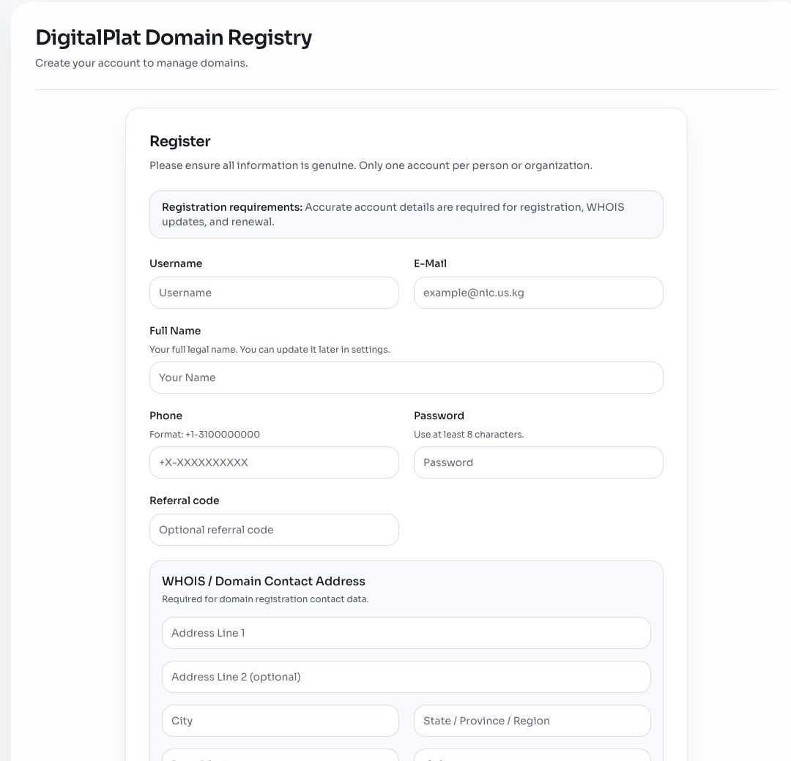

# Create a DigitalPlat Account

An account stores registration contact data and provides access to the domain Dashboard.

## Prepare Before Registration

- An email address you can continue to access
- Your accurate name or organization name
- A valid phone number in the format requested by the form
- A complete contact address
- A unique password stored in a password manager

Do not use fictional textbook values as real registration data.

## Open the Registration Form

Open the account registration page from the official DigitalPlat Dashboard.

## Complete the Account Fields

- Use a monitored email address because it may receive recovery and policy notices.
- Enter accurate registration contact data.
- Use a unique password that is not shared with the email account.
- Enter a referral code only when you intentionally have one.

## WHOIS and Billing Addresses

The form separates domain contact information from billing information. If the interface offers a same-address option, review the copied result before submission.

Public visibility and required registration data depend on current namespace and privacy policy. Read the information presented by the Dashboard.

## Review Policies

Read the current:

- Terms of Service
- Privacy Policy
- Acceptable Use Policy
- Additional namespace or account policies shown by the product

Only submit accurate data after agreeing to the applicable terms.

## Verify the Account

1. Confirm the Dashboard opens.
2. Confirm the account email is correct.
3. Save recovery information securely.
4. Sign out and sign in once.
5. Record the responsible account owner privately.

Never publish a screenshot containing a password, full address, account ID, recovery code, or active session information.

Continue to [Register a FreeDomain Name](./1.2-domain-registration.md).
