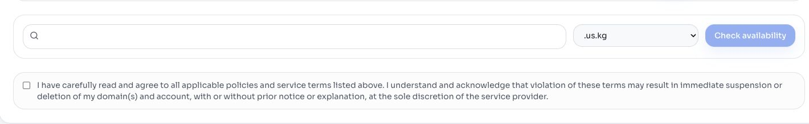

# Register a FreeDomain Name

This chapter covers the DigitalPlat registration workflow. Ordinary DNS records will be configured later at an external DNS service.

## Read Current Notices First

Open the Dashboard notice board. Supported suffixes, registration pauses, slot requirements, prices, limits, renewal windows, and policies may change.

Do not treat an old screenshot as proof of current availability or cost.

## Prepare External Nameservers

The registration workflow may require authoritative nameserver hostnames. Create the intended zone at an external DNS service and copy every assigned nameserver.

Example format:

```text
ns1.dns-service.example
ns2.dns-service.example
```

These are hostnames, not DNS resolver addresses and not website IP addresses.

## Open Registration

Choose **Register** in the Dashboard.



Read the policies associated with the suffix you intend to select.

## Check the Name

1. Enter the requested label.
2. Choose a suffix.
3. Select **Check availability**.
4. Review the complete resulting name.
5. Review the displayed slot or payment requirement.

Avoid names that impersonate others, infringe rights, mislead users, or violate current policies.

## Submit Carefully

Before final submission, check:

- Complete domain spelling
- Selected suffix
- External nameserver hostnames
- Registrant information
- Policy acknowledgement
- Slot or charge displayed by the Dashboard

Registration can create external state and may consume a slot or create a charge. Stop when any value is unexpected.

## Confirm the Result

Open **Domain List** and locate the exact name. Record its status and expiration date privately.

A pending or rejected result should be investigated from the displayed reason. Possible causes include unavailable names, invalid external nameservers, incomplete registration data, or a current namespace restriction.

Continue to [Connect External Nameservers](./1.3-connect-nameservers.md).
