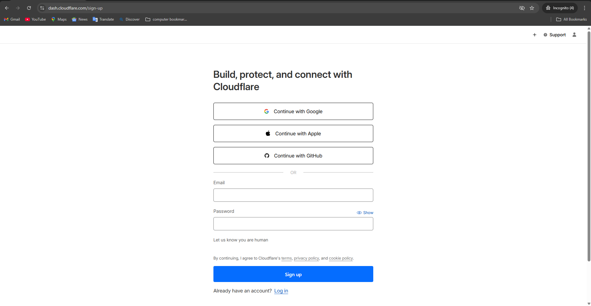
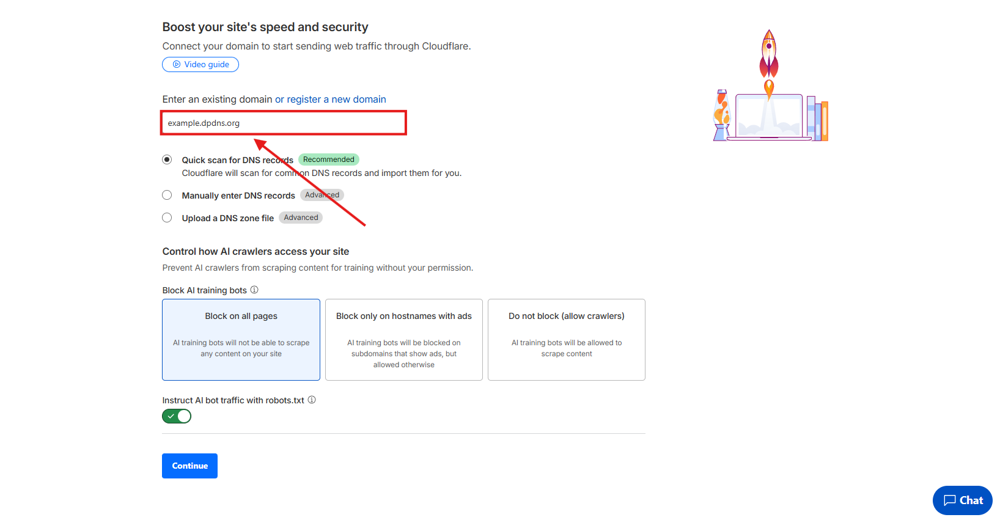
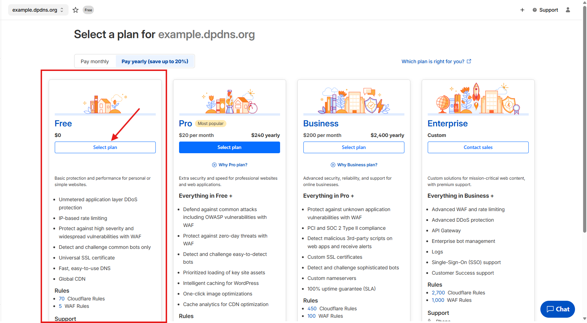
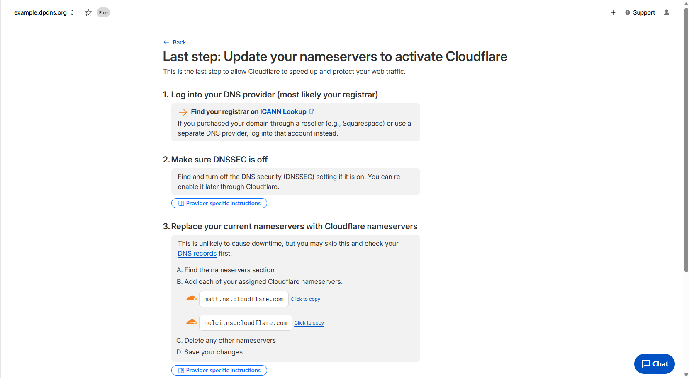
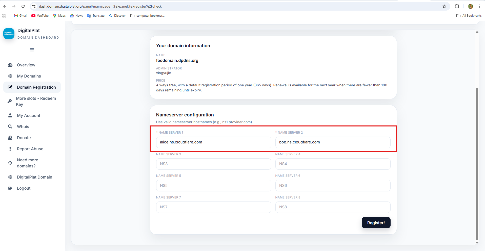

# Connect External Nameservers

DigitalPlat delegates the registered domain to an external authoritative DNS service. It does not provide the editor for ordinary DNS records.

DigitalPlat does not endorse or guarantee any third-party DNS service. The screenshots below use Cloudflare only as a short interface example.

## Create the External Zone

Create an account with the external DNS service and add the complete domain.





Choose an external service plan that meets your own requirements.



## Copy Assigned Nameservers

The external service assigns authoritative nameserver hostnames.



Copy every hostname exactly. Do not enter an IP address, public resolver address, or DNS record value in the DigitalPlat nameserver fields.

## Save Nameservers in DigitalPlat

Enter the assigned external nameserver hostnames during registration or in the available domain management workflow.



DigitalPlat's responsibility ends at delegation. After delegation, open the external DNS service to create website, email, or verification records.

## Verify Delegation

```bash
dig NS example.dpdns.org
```

The answer must contain the same external nameservers entered in DigitalPlat.

Trace the parent path when needed:

```bash
dig +trace NS example.dpdns.org
```

Ask an external authoritative server directly:

```bash
dig @ns1.dns-service.example SOA example.dpdns.org
```

## Common Mistakes

| Mistake | Correct action |
| --- | --- |
| Entering a server IP as an NS value | Enter the assigned authoritative nameserver hostname |
| Looking for an A-record editor in DigitalPlat | Open the external DNS zone |
| Creating a zone with the wrong domain spelling | Recreate or correct the external zone before delegation |
| Entering only one of several assigned nameservers | Enter the complete assigned set |
| Waiting when the external authoritative server has no zone | Fix the external zone first |

Continue to [Check Status and Renew](./1.4-status-and-renewal.md).
